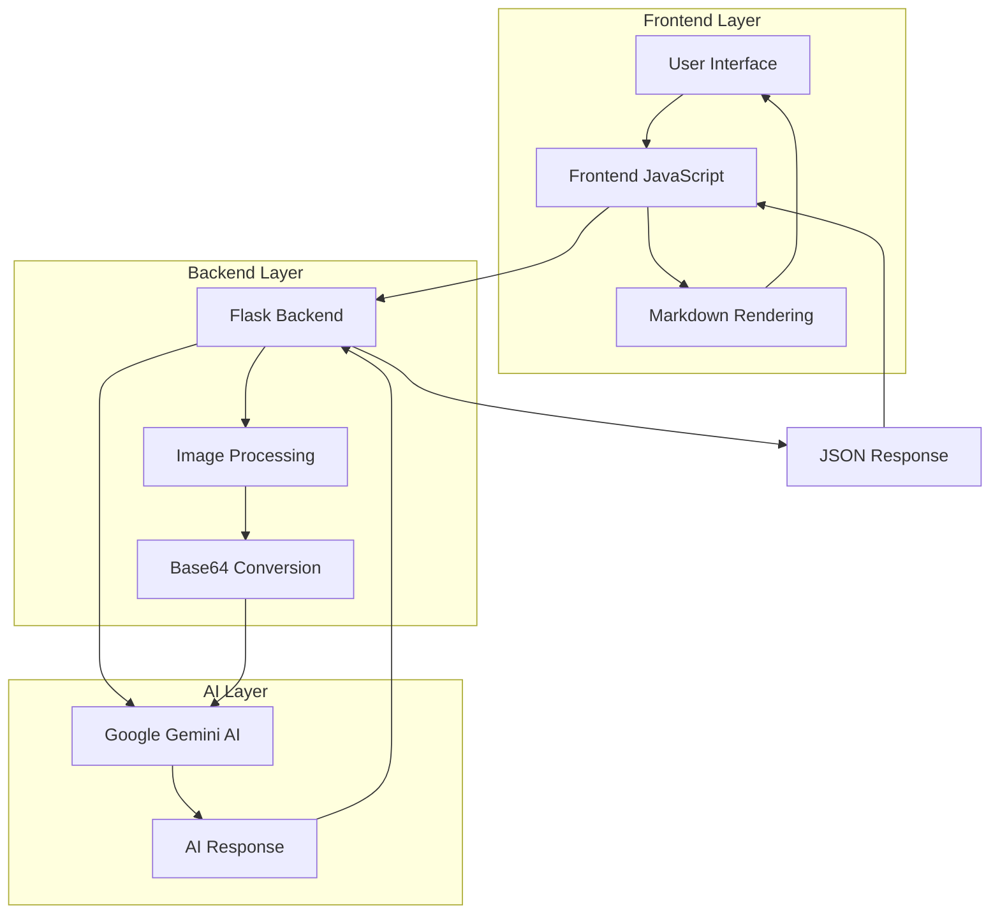

# Gemini AI Chat Application


A modern, responsive web application that integrates Google's Gemini AI for intelligent conversations with image analysis capabilities. Built with Flask backend and vanilla JavaScript frontend, featuring a beautiful gradient UI and real-time typing animations.

## Live Demo

**[Try the Live Demo](https://q-a-chatbot-with-gemini.onrender.com)**

## Features

- **AI-Powered Conversations**: Powered by Google's Gemini AI model
- **Image Analysis**: Upload and analyze images with AI
- **Real-time Chat**: Smooth typing animations and instant responses
- **Modern UI**: Beautiful gradient design with glassmorphism effects
- **Responsive Design**: Works perfectly on desktop, tablet, and mobile
- **Fast Performance**: Optimized for speed and smooth user experience
- **Secure**: Environment-based API key management
- **Production Ready**: Configured for easy deployment

## Technology Stack

### Backend
- **Flask 3.0** - Web framework
- **Google Generative AI** - AI model integration
- **Pillow** - Image processing
- **Gunicorn** - Production WSGI server

### Frontend
- **Vanilla JavaScript** - Interactive functionality
- **CSS3** - Modern styling with gradients and animations
- **Font Awesome** - Icons
- **Marked.js** - Markdown rendering

## Application Architecture



## Prerequisites

- Python 3.10 or higher
- Google Gemini API key ([Get it here](https://makersuite.google.com/app/apikey))

## Quick Start

### 1. Clone the Repository
```bash
git clone https://github.com/your-username/gemini-chat-app.git
cd gemini-chat-app
```

### 2. Create Virtual Environment
```bash
python -m venv venv
source venv/bin/activate  # On Windows: venv\Scripts\activate
```

### 3. Install Dependencies
```bash
pip install -r requirements.txt
```

### 4. Set Up Environment Variables
Create a `.env` file in the root directory:
```env
GOOGLE_API_KEY=your_gemini_api_key_here
```

### 5. Run the Application
```bash
python app.py
```

Visit `http://localhost:5000` to see your application!

## Project Structure

```
gemini-chat-app/
├── app.py                 # Main Flask application
├── requirements.txt       # Python dependencies
├── runtime.txt           # Python version specification
├── Procfile             # Deployment configuration
├── .env                 # Environment variables (create this)
├── static/
│   ├── style.css        # Modern CSS styling
│   └── script.js        # Interactive JavaScript
├── templates/
│   └── index.html       # Main HTML template
└── README.md           # This file
```

## Key Features Explained

### AI Integration
- Uses Google's Gemini AI model (`gemma-3-27b-it`)
- Supports both text and image inputs
- Handles errors gracefully with user-friendly messages

### Image Processing
- Accepts various image formats (JPEG, PNG, GIF, etc.)
- Converts images to base64 for API transmission
- Provides image preview before sending

### User Interface
- **Glassmorphism Design**: Modern frosted glass effects
- **Gradient Backgrounds**: Beautiful color transitions
- **Responsive Layout**: Adapts to all screen sizes
- **Smooth Animations**: Typing effects and transitions
- **Dark Input Box**: Sleek, modern input design

### Real-time Features
- **Typing Indicators**: Shows when AI is responding
- **Auto-scroll**: Automatically scrolls to new messages
- **Markdown Support**: Renders formatted AI responses
- **Loading States**: Visual feedback during processing

## Configuration

### Environment Variables
- `GOOGLE_API_KEY`: Your Google Gemini API key (required)
- `PORT`: Server port (default: 5000)

### Customization Options
- Modify `app.py` to change AI model or add features
- Update `static/style.css` for UI customization
- Extend `static/script.js` for additional functionality


**Made with Flask and Google AI**
